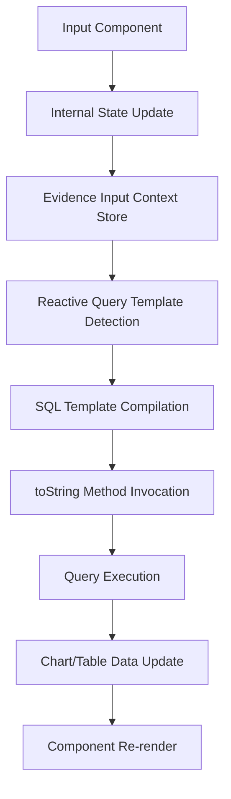
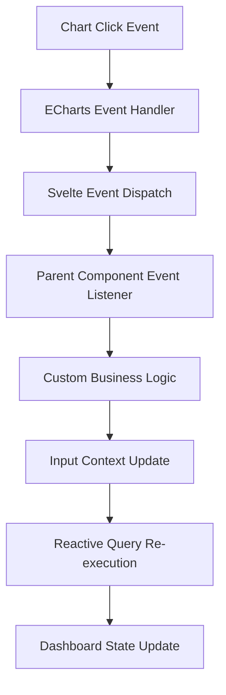

# Evidence State Management - Complete Architectural Analysis

## Overview

Evidence implements a sophisticated **reactive state management system** that seamlessly connects input components, SQL queries, and visualization components through a centralized input context store. This document provides an exhaustive analysis of how Evidence components manage state and interactivity.

## Core Architecture

### Three-Layer State Management System

1. **Component-Level State**: Each component manages its internal state (dropdownOptionStore, local variables)
2. **Evidence Input Context**: Global reactive store shared across all components (`$inputs[name]`)
3. **SQL Serialization**: Components provide `toString()` methods for SQL template interpolation

### Data Flow Pattern

```
Input Component → Internal State → Evidence Input Context → SQL Template Processing → Query Execution → Chart/Table Update
```

## 1. Evidence Input Context System

### Core Infrastructure (`/packages/lib/sdk/src/utils/svelte/inputs.js`)

**Key Components:**
- **`InputStoreKey`**: Symbol-based context key for global input store
- **`getInputContext()`**: Returns the global writable input store 
- **`getInputSetter(inputKey, toggle, defaultSqlFragment)`**: Factory function for input value setters
- **`ensureInputContext(store)`**: Ensures input context exists and handles initialization

**Input Store Architecture:**
```javascript
const inputs = getInputContext(); // Writable<Record<string, any>>

// Each input component updates the store with this format:
$inputs[componentName] = {
  value: actualValue,           // Raw value
  label: displayLabel,          // Human-readable label
  toString() { return sqlFragment; },  // CRITICAL for SQL interpolation
  rawValues: [...],            // For complex components like dropdowns
  // Additional metadata...
}
```

**Initialization Pattern:**
```javascript
// 1. Page-level initialization (in Svelte layout or page)
import { ensureInputContext } from '@evidence-dev/sdk/utils/svelte';
import { writable } from 'svelte/store';

const inputStore = writable({});
ensureInputContext(inputStore);

// 2. Component-level access
import { getInputContext } from '@evidence-dev/sdk/utils/svelte';
const inputs = getInputContext();

// 3. Component updates
$inputs[componentName] = { value, label, toString() { return sqlFragment; } };
```

## 2. Input Components State Management

### Dropdown Component (`/packages/ui/core-components/src/lib/atoms/inputs/dropdown/Dropdown.svelte`)

**State Architecture:**
```javascript
const inputs = getInputContext();

// Internal state management via dropdownOptionStore
const { options, selectedOptions, toggleSelected } = dropdownOptionStore({
  multiselect: multiple,
  defaultValues: Array.isArray(defaultValue) ? defaultValue : [defaultValue],
  initialOptions: initialOptions,
  noDefault,
  selectAllByDefault
});

// Bridge to Evidence input context via subscription
onDestroy(
  selectedOptions.subscribe(($selectedOptions) => {
    const values = $selectedOptions.filter((o) => !o.__removeOnDeselect);
    
    if (multiple) {
      // Multi-select: Generate SQL IN clause
      updateInputStore({
        label: values.map((x) => x.label).join(', '),
        value: values.length ? `(${values.map((x) => duckdbSerialize(x.value))})` : `(select null where 0)`,
        toString() { return this.value; },
        rawValues: values
      });
    } else {
      // Single select: Generate simple SQL value
      updateInputStore({
        label: values[0]?.label || defaultTitle,
        value: duckdbSerialize(values[0]?.value, { serializeStrings: false }),
        toString() { return this.value; },
        rawValues: values
      });
    }
  })
);
```

**Key Features:**
- **Two-tier state management**: Internal dropdownOptionStore + Evidence input context
- **SQL serialization** using `duckdbSerialize()` for injection-safe SQL
- **Multi-select support** with automatic IN clause generation
- **Reactive bridging** through Svelte store subscriptions

### TextInput Component (`/packages/ui/core-components/src/lib/atoms/inputs/text/TextInput.svelte`)

**State Management:**
```javascript
const inputs = getInputContext();

const setInputStore = () => {
  let sqlString = value;
  if (!unsafe) sqlString = sqlString.replaceAll("'", "''"); // SQL escaping
  
  $inputs[name] = {
    toString() { return sqlString; },
    sql: `'${sqlString}'`,
    search: (col) => `damerau_levenshtein(${col}, '${sqlString}')` // Fuzzy search function
  };
};

// Reactive updates on value changes
$: {
  if (value) touched = true;
  if (touched) setInputStore();
}
```

**Key Features:**
- **Direct Evidence context updates** via `$inputs[name] = value`
- **SQL injection protection** with automatic escaping
- **Search function generation** for fuzzy matching capabilities
- **Immediate reactivity** on value changes

### DateRange Component (`/packages/ui/core-components/src/lib/atoms/inputs/date-range/DateRange.svelte`)

**State Management:**
```javascript
function onSelectedDateInputChange(selectedDateInput) {
  if (selectedDateInput && (selectedDateInput.start || selectedDateInput.end) && range) {
    // Date range mode
    $inputs[name] = {
      start: dateToYYYYMMDD(selectedDateInput.start?.toDate(getLocalTimeZone())),
      end: dateToYYYYMMDD(selectedDateInput.end?.toDate(getLocalTimeZone())),
      toString() {
        return `BETWEEN '${this.start}' AND '${this.end}'`;
      }
    };
  } else if (selectedDateInput && !range) {
    // Single date mode
    $inputs[name] = {
      value: dateToYYYYMMDD(selectedDateInput.toDate(getLocalTimeZone())),
      toString() {
        return `'${this.value}'`;
      }
    };
  }
}
```

**Key Features:**
- **Date normalization** to YYYY-MM-DD format
- **Range vs single date handling** with different SQL patterns
- **Timezone conversion** support
- **SQL BETWEEN clause generation** for date ranges

### Checkbox Component (`/packages/ui/core-components/src/lib/atoms/inputs/checkbox/Checkbox.svelte`)

**State Management:**
```javascript
const inputs = getInputContext();
let isChecked = toBoolean(defaultValue) || toBoolean(checked);

// Simplest pattern - direct boolean assignment
$: $inputs[name] = {
  value: isChecked,
  toString() {
    return isChecked ? 'TRUE' : 'FALSE';
  }
};
```

**Key Features:**
- **Simplest input pattern** - direct boolean value assignment
- **SQL boolean conversion** to TRUE/FALSE strings
- **Immediate reactivity** through Svelte reactive statements

## 3. Chart Components Interactivity

### Chart Architecture Overview

Evidence charts are **primarily data consumers**, not input context updaters. The architecture follows:

```
BarChart.svelte (wrapper)
  └── Chart.svelte (query loading + error handling)
      └── _Chart.svelte (config generation)
          └── ECharts.svelte (rendering + event handling)
```

### ECharts Integration (`/packages/ui/core-components/src/lib/unsorted/viz/core/ECharts.svelte`)

**Event System:**
```javascript
import { createEventDispatcher } from 'svelte';
const dispatch = createEventDispatcher();

// ECharts event forwarding (in /packages/lib/component-utilities/src/echarts.js)
chart.on('click', function (params) {
  dispatch('click', {
    ...params,
    detail: params // Svelte event convention
  });
});

chart.on('datazoom', function (params) {
  dispatch('datazoom', params);
});
```

**Key Features:**
- **Event forwarding only** - charts don't manipulate input context directly
- **ECharts event bubbling** through Svelte's event system
- **Click data exposure** with series, data point, and axis information
- **Custom event handling** via parent component event listeners

### DataTable Interactivity (`/packages/ui/core-components/src/lib/unsorted/viz/table/_DataTable.svelte`)

**Internal State Management:**
```javascript
// DataTable manages its own internal state, separate from Evidence input context
let props = writable({});
setContext(propKey, props);

// Search functionality (internal only)
const updateQuery = browserDebounce(() => {
  if (search && hasQuery) {
    const searchQuery = query.search(search, 'label');
    // Updates internal query, doesn't touch global input context
  }
}, 100);

// Sorting (internal UI state)
let sortObj = {};
$: if (sort) {
  const [column, direction] = sort.split(' ');
  sortBy = column;
  sortDirection = direction;
  sortAsc = direction === 'desc' ? false : true;
  sortObj = sortBy ? { col: sortBy, ascending: sortAsc } : { col: null, ascending: null };
}
```

**Key Features:**
- **Internal state management** via props store and context
- **No global input context updates** - DataTable is a display component
- **Search and sorting** are internal UI state, not shared application state
- **Query-based filtering** rather than input-parameter-based filtering

## 4. Template Literal Processing System

### SQL Query Processing (`/packages/lib/preprocess/src/process-queries.cjs`)

**Reactive Query Detection:**
```javascript
// Evidence scans for reactive query patterns during preprocessing
const IS_REACTIVE_QUERY = /\${.*?}/s;
const reactiveIds = validIds.filter((id) =>
  IS_REACTIVE_QUERY.test(duckdbQueries[id].compiledQueryString)
);

// Specifically detects input-dependent queries
const IS_INPUT_QUERY = /\${\s*inputs\s*\..*?}/s;
const input_ids = reactiveIds.filter((id) =>
  IS_INPUT_QUERY.test(duckdbQueries[id].compiledQueryString)
);
```

**Template Literal Compilation:**
```javascript
// Original SQL template:
let __queryText = `SELECT * FROM orders WHERE status = ${inputs.status_filter}`;

// When inputs.status_filter updates, its toString() method is called:
inputs.status_filter = {
  value: 'approved',
  label: 'Approved',
  toString() { return "'approved'"; } // SQL-safe string with quotes
};

// Final compiled query becomes:
// "SELECT * FROM orders WHERE status = 'approved'"
```

### Proxy Pattern for Unset Values (`/packages/lib/sdk/src/usql/setTrackProxy/setTrackProxy.js`)

**Unset Value Tracking:**
```javascript
// Evidence uses proxy objects to track unset values in SQL templates
export const hasUnsetValues = (strings, ...args) => {
  const unsetValues = args.filter((arg) => arg?.[Unset]);
  return unsetValues.length > 0;
};

// toString() method handling on proxy objects:
case 'toString':
case 'toPrimitive':
case Symbol.toPrimitive:
  if (self[Unset]) {
    if (ownKey && ownKey in defaultStringMap) return () => defaultStringMap[ownKey];
    return () => ``; // Returns empty string for unset values
  } else return root.toString.bind(root);
```

**Key Features:**
- **Automatic unset value detection** prevents broken SQL queries
- **Safe default values** for missing input parameters
- **toString() method invocation** during SQL compilation
- **SQL injection prevention** through controlled serialization

## 5. Component Communication Patterns

### Input → Query Flow



### Chart Event Flow



### Cross-Component Communication

**Pattern 1: Input → Query → Chart**
```javascript
// Input component updates global context
$inputs[filterName] = { value: newValue, toString() { return sqlValue; } };

// Reactive query automatically detects change and re-executes
// SQL: SELECT * FROM data WHERE category = ${inputs.filterName}

// Chart receives new data and re-renders automatically
<BarChart data={filteredData} />
```

**Pattern 2: Chart → Custom Logic → Input**
```javascript
// Chart click event
<BarChart 
  data={salesData} 
  on:click={(event) => {
    const clickedCategory = event.detail.name;
    
    // Update input context based on chart interaction
    const filterSetter = getInputSetter('categoryFilter');
    filterSetter(clickedCategory, clickedCategory, `'${clickedCategory}'`);
  }}
/>
```

## 6. Key Architectural Insights

### Input Components Design Principles

1. **Two-Tier State Management**: Internal component state + Evidence global context
2. **SQL-Safe Serialization**: All values provide toString() methods for safe SQL embedding
3. **Real-Time Reactivity**: Immediate updates to global context trigger query re-execution
4. **Type-Specific Handling**: Different input types (dates, arrays, strings) have specialized serialization
5. **Injection Prevention**: Automatic SQL escaping and parameterization

### Chart Components Design Principles

1. **Data Consumers**: Charts primarily display data, don't manipulate global state
2. **Event Forwarding**: Rich event system for custom interactivity
3. **Separation of Concerns**: Visualization logic separate from state management
4. **Reactive Data Binding**: Automatic re-rendering when data props change
5. **ECharts Integration**: Full ECharts event system exposure through Svelte events

### State Management Benefits

1. **Declarative**: Input changes automatically flow through to visualizations
2. **Type-Safe**: SQL serialization prevents injection attacks
3. **Reactive**: Real-time updates without manual change detection
4. **Modular**: Components can be combined without coupling
5. **Debuggable**: Clear data flow and state inspection capabilities

## 7. Runtime Integration Patterns

### Proper Evidence Integration for Runtime Processing

```javascript
// 1. Initialize Evidence context (once per page)
import { getInputContext, ensureInputContext } from '@evidence-dev/sdk/utils/svelte';
import { writable } from 'svelte/store';

const inputStore = writable({});
ensureInputContext(inputStore);
const inputs = getInputContext();

// 2. Component integration pattern
const inputs = getInputContext();

// 3. Update Evidence context with proper format
$inputs[componentName] = {
  value: actualValue,
  label: displayLabel,
  toString() { return sqlFragment; }, // Critical for SQL interpolation
  rawValues: [...] // For complex components
};

// 4. Template literal usage in SQL
// Evidence automatically calls toString() when processing:
// SELECT * FROM table WHERE column = ${inputs.componentName}
```

### Avoiding Common Pitfalls

1. **Don't create stores inside reactive blocks** - violates Svelte rules
2. **Always provide toString() methods** for SQL compatibility
3. **Use proper SQL escaping** for string values
4. **Subscribe to component stores, update Evidence context** - don't bypass the bridge pattern
5. **Let Evidence handle query re-execution** - don't manually trigger updates

This comprehensive architecture enables Evidence to provide a **seamless, reactive dashboard experience** where input changes automatically propagate through SQL queries to visualization updates, while maintaining security, performance, and developer experience.